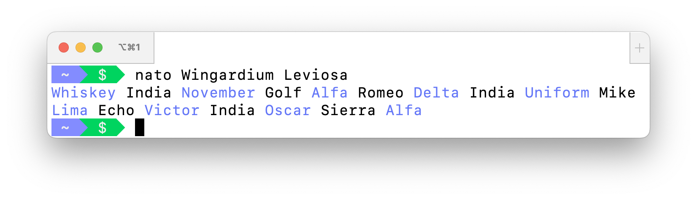

# NATO phonetic alphabet

> The International Radiotelephony Spelling Alphabet or simply the Radiotelephony Spelling Alphabet, commonly known as the NATO phonetic alphabet, is the most widely used set of clear-code words for communicating the letters of the Roman alphabet. Technically a radiotelephonic spelling alphabet, it goes by various names, including NATO spelling alphabet, ICAO phonetic alphabet, and ICAO spelling alphabet. The ITU phonetic alphabet and figure code is a rarely used variant that differs in the code words for digits.
>
> — https://en.wikipedia.org/wiki/NATO_phonetic_alphabet

## Installation

```
go get -u github.com/cixtor/nato
```

## Usage

```
$ nato Wingardium Leviosa
Whiskey India November Golf Alfa Romeo Delta India Uniform Mike
Lima Echo Victor India Oscar Sierra Alfa
```


